# 🍰 Dulce Control - ERP Postres

Sistema ERP desarrollado para la gestión integral de una empresa de postres, permitiendo controlar la producción, ventas e inventario mediante el manejo de insumos por lotes y la aplicación de la regla de negocio **FIFO** para una administración eficiente del stock.

---

# 📌 Descripción

**Dulce Control** es un sistema ERP enfocado en la gestión de negocios de postres, diseñado para controlar todo el flujo operativo desde el ingreso de insumos hasta la venta final del producto.

El sistema permite:

* gestionar usuarios y roles
* controlar insumos por lotes
* aplicar FIFO en inventario
* registrar preparaciones
* realizar ventas
* monitorear el stock
* visualizar reportes
* administrar el negocio desde un dashboard central

Todo el sistema está construido con una arquitectura moderna basada en **NestJS + React + PostgreSQL**.

---

# 🧠 Regla de negocio principal

El sistema trabaja con **FIFO (First In, First Out)** para el control del inventario.

Esto significa que:

> el primer insumo que entra es el primero que se utiliza en las preparaciones y ventas.

Beneficios:

* control real del stock
* reducción de pérdidas
* trazabilidad por lotes
* gestión eficiente de inventario
* mejor control de producción

---

# 🛠️ Tecnologías utilizadas

## Backend

* NestJS
* PostgreSQL
* TypeORM
* JWT
* REST API
* Arquitectura modular

---

## Frontend

* React
* Vite
* TypeScript
* TailwindCSS
* Shadcn UI
* Axios
* Zod
* React Hook Form

---

# 🧩 Módulos del sistema

El ERP cuenta con los siguientes módulos:

### 🔐 Autenticación

* login
* protección de rutas
* JWT
* control de sesiones

---

### 👥 Usuarios

* gestión de usuarios
* roles
* permisos
* administración del sistema

---

### 📦 Insumos

* ingreso de insumos por lotes
* control de stock
* fechas de ingreso
* trazabilidad

---

### 🍮 Preparaciones

* creación de preparaciones
* consumo automático de insumos
* aplicación de FIFO
* control de producción

---

### 💰 Ventas

* registro de ventas
* selección de preparaciones
* control de estados
* historial

---

### 📊 Inventario

* stock en tiempo real
* control de lotes
* consumo por FIFO

---

### 📈 Reportes

* reportes operativos
* control de movimientos
* análisis de datos

---

### 🧭 Dashboard

* resumen general del sistema
* métricas
* indicadores

---

### 🛡️ Roles y permisos

* control de accesos
* seguridad del sistema

---

# 📸 Capturas del sistema

## 📋 Index

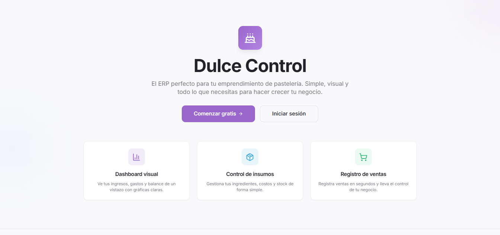

---

## 🔐 Login

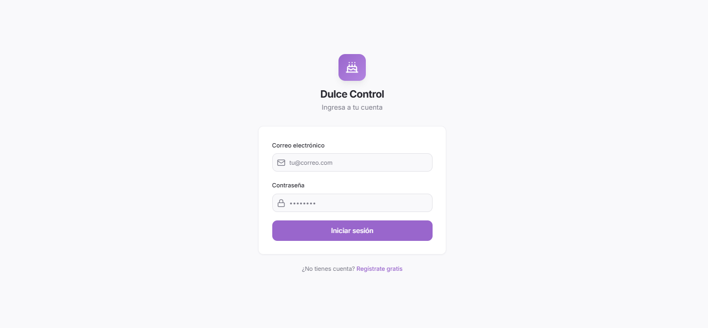

---

## 🧭 Dashboard

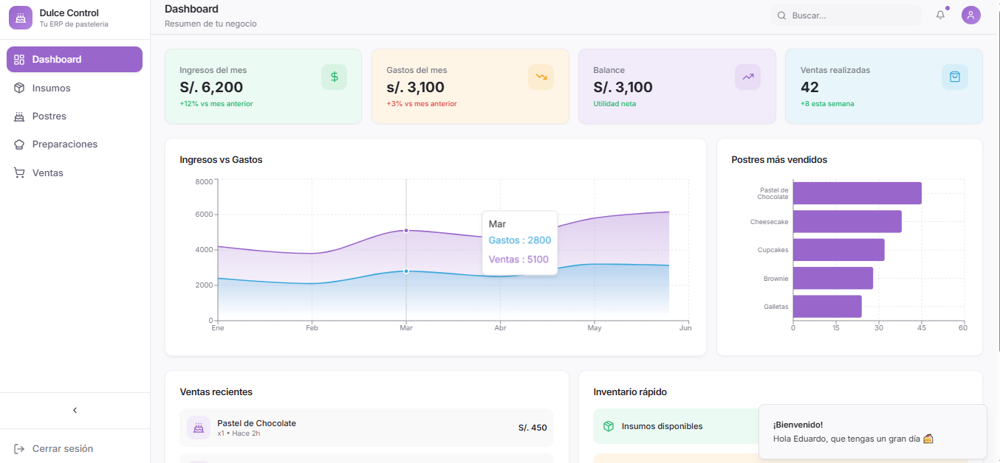

---


## 🍰 Insumos

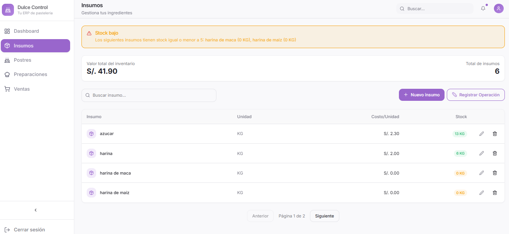

---

## 📦 Postres

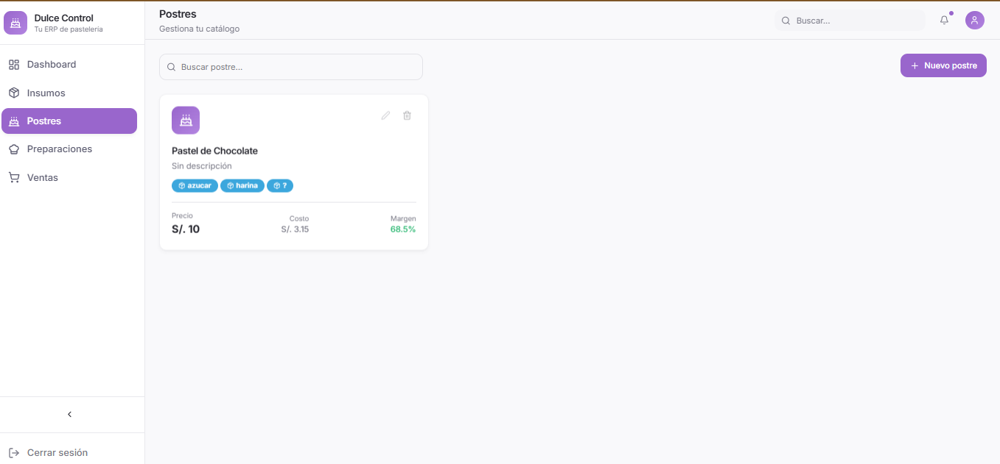

---

## 🍮 Preparaciones

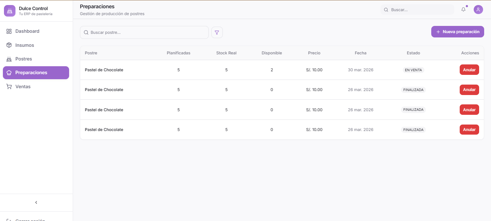

---

## 💰 Ventas

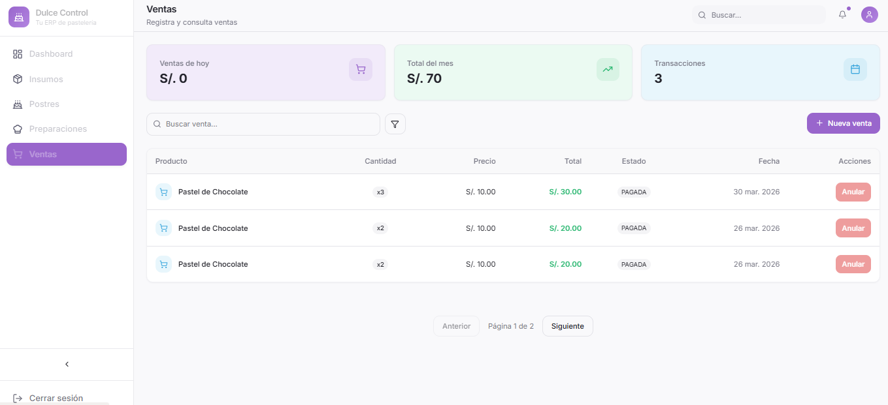

---

## 🔍 Filtros

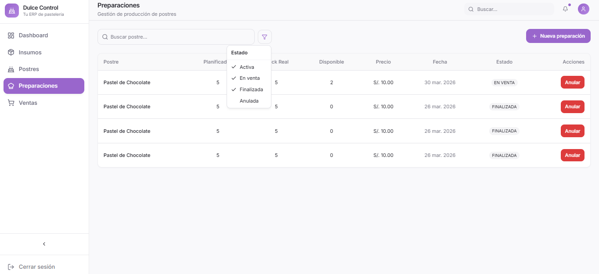

---

## 📄 Paginación

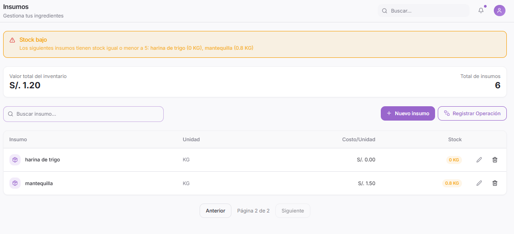

---

## 🧾 Dialog Venta

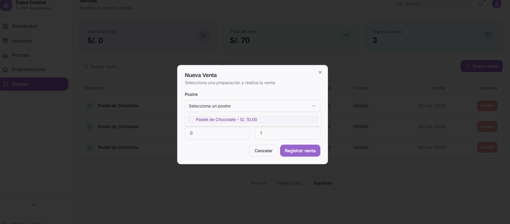

---

## 🧾 Dialog Preparación

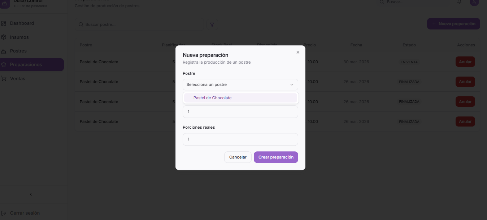

---

## 🧾 Dialog Postre

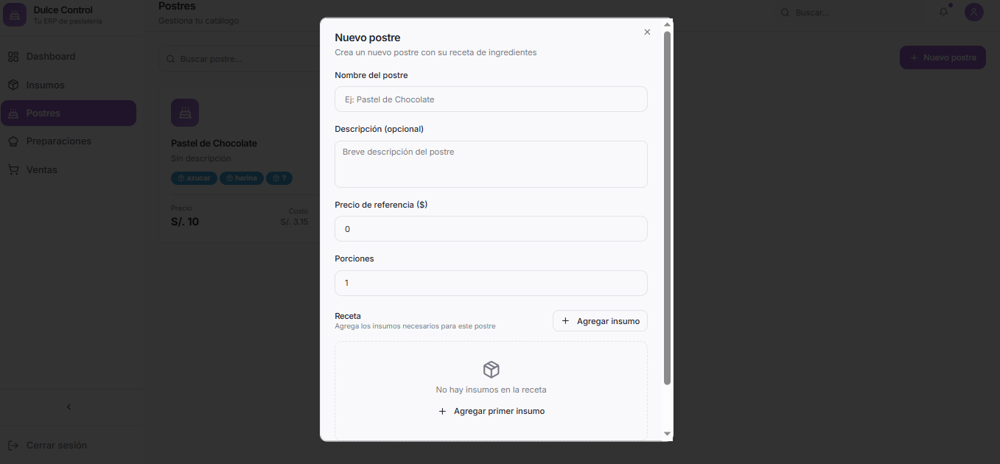

---

# ⚙️ Instalación del proyecto

## 1️⃣ Clonar repositorio

```bash
git clone https://github.com/AngelQP/Frontend-ERP-React.git

git clone https://github.com/AngelQP/Backend-ERP-NestJS.git
```

---

# 🧩 Backend

### instalar dependencias

```bash
npm install
```

### ejecutar

```bash
nest start -w
```

---

# 🎨 Frontend

### ingresar a la carpeta

### instalar dependencias

```bash
yarn
```

### ejecutar

```bash
yarn dev
```

---

# 🗄️ Variables de entorno

El sistema se configura mediante un archivo **.env**

## Backend

```
DB_HOST=
DB_PORT=
DB_USER=
DB_PASS=
DB_NAME=
JWT_SECRET=
```

---

# 🔌 API

El backend trabaja con una API REST construida en NestJS.

Principales endpoints:

* auth
* users
* insumos
* preparaciones
* ventas
* inventario
* reportes

---

# 🏗️ Arquitectura

El sistema sigue una arquitectura modular:

```
backend
 ├── auth
 ├── users
 ├── insumos
 ├── preparaciones
 ├── ventas
 ├── inventario
 └── reportes

frontend
 ├── components
 ├── features
 ├── pages
 ├── services
 └── hooks
```

---

# 🚀 Estado del proyecto

Sistema en desarrollo activo.

Incluye:

* arquitectura ERP
* control FIFO
* gestión de producción
* ventas
* inventario
* dashboard
* seguridad con JWT

---

# 👨‍💻 Autor

Desarrollado por **Angel**

Backend Developer apasionado por la construcción de sistemas escalables y arquitecturas limpias.

---

# 📄 Licencia

Proyecto de uso educativo y profesional.
